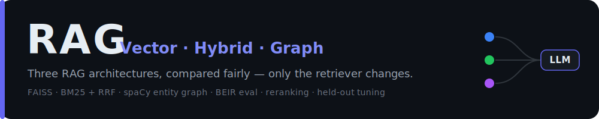
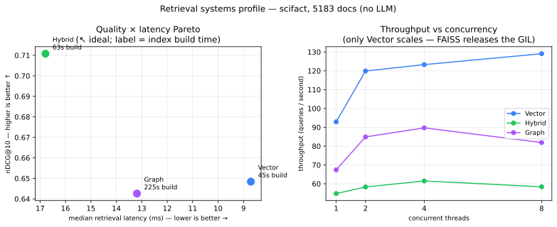

<div align="center">



<br/>
<br/>


[](LICENSE)
[](https://github.com/gyom15/rag-vector-hybrid-graph/actions)
[](https://huggingface.co/spaces/gyom15/rag-vector-hybrid-graph)

[**🔗 Live demo**](https://huggingface.co/spaces/gyom15/rag-vector-hybrid-graph) · [Architecture](#architecture) · [Quickstart](#quickstart) · [Evaluation](#evaluation) · [Roadmap](#roadmap)

</div>

---

Comparative study of three **Retrieval-Augmented Generation** architectures on the
**same corpus, chunking, prompt and LLM** — only the *retrieval strategy* changes,
so the comparison is fair (controlled variables).

| Stack | Retrieval | What it adds |
|------|-----------|--------------|
| **Vector** | dense similarity (FAISS) | semantic meaning |
| **Hybrid** | vector + BM25, fused by **RRF** | exact keywords (dates, names, codes) |
| **Graph** | spaCy NER → entity graph (networkx) + **local-search** (query entities via MENTIONS/RELATED_TO, IDF-weighted) | relational / multi-hop |

## Highlights

**🔗 [Live demo](https://huggingface.co/spaces/gyom15/rag-vector-hybrid-graph)** — the 3 retrievers side by side + an in-app evaluation dashboard, on a free CPU Space.

- **Fair by construction** — same corpus, chunking, prompt and LLM; *only the retriever changes*.
- **Hybrid (BM25 + dense + RRF) is the robust winner** across 3 BEIR corpora (SciFact / HotpotQA / NFCorpus).
- **Debugged the Graph at scale** — found *why* it failed (entity-hub pollution), fixed it with a principled normalization, exponent chosen on a **held-out split** (never on test).
- **Reranking doesn't generalize** — *replace* vs *fuse* flips by dataset; measured, with the rule for when to use which.
- **Reader quality > size** — a 1.5B *instruct* model (Qwen2.5) reads a distractor correctly where a 3B (Llama-3.2) misreads it — shown **live**.
- **The generator is the bottleneck** end-to-end — better retrieval ≠ better answers without a capable reader.
- **Built like production** — deterministic (temp 0), a **regression guard in CI** (nDCG gate), honest negative results, and an **audit** that re-ran every claim and corrected two overstatements.

## Contents

- [Architecture](#architecture) — the 3 retrievers, controlled variables
- [Quickstart](#quickstart) — install · run · reproduce the eval
- [Evaluation](#evaluation)
  - [Diagnosing & fixing the graph at scale](#diagnosing-and-fixing-the-graphs-failure-at-scale) — the diagnose → fix → held-out story
  - [Performance & systems](#performance--systems) — build cost, latency p95/p99, throughput, Pareto
  - [Reranking](#reranking--does-it-help-and-how-should-you-do-it) — does it help, and *how*? (replace vs fuse)
- [Roadmap](#roadmap) · [Tests](#tests) · [Data](#data) · [License](#license)

## Architecture


Only the **retriever** differs between stacks; chunking, embeddings, FAISS index,
prompt and LLM are shared. `pipeline.build_stacks()` is the single source of truth
used by both the app and the benchmark.

An **optional cross-encoder reranking stage** plugs in without touching the stacks:
set `RERANK_MODE=replace` (or `fusion`) and every retriever is wrapped in a
`RerankedRetriever` decorator (retrieve a wider top-N → rerank → top-k). It is **off
by default** — the [reranking eval](#reranking--does-it-help-and-how-should-you-do-it)
shows the benefit is dataset-dependent, so the *eval decides* and the *pipeline integrates*.

## A RAG answer has two stages

A wrong answer can come from **retrieval** (the right chunk never reaches the
context) *or* from **generation** (the chunk is there but the model misreads it).
Both must succeed — the matrix below shows why raising `k` alone or upgrading the
model alone is not enough:


## Project structure

```
rag-vector-hybrid-graph/
├── src/
│   ├── shared/
│   ├── stack1_traditional/
│   ├── stack2_hybrid/
│   ├── stack3_graphrag/
│   └── pipeline.py
├── eval/
├── app/
├── tests/
└── docs/
```

`src/` is the library (shared core + the 3 stacks + `pipeline`), `eval/` the
benchmark, `app/` the Streamlit dashboard.

## Quickstart

### 1. Install

```bash
python3.11 -m venv .venv && source .venv/bin/activate
pip install -e .                 # core: library + Streamlit app
pip install -e ".[eval]"         # + RAGAS benchmark
pip install -e ".[dev]"          # + pytest / ruff
python -m spacy download en_core_web_sm   # NER model used by the graph stack
```

### 2. Pick an LLM backend

Generation needs an LLM, selected by `LLM_PROVIDER` (copy `.env.example` → `.env`):

| Provider | Env vars | Model type | When |
|---|---|---|---|
| `ollama` *(default)* | `OLLAMA_URL`, `OLLAMA_MODEL` | decoder LLM (llama3.2…) | local dev |
| `openai` | `OPENAI_BASE_URL`, `OPENAI_API_KEY`, `OPENAI_MODEL` | decoder LLM | OpenAI **or a vLLM server** |
| `huggingface` | `HF_MODEL` | seq2seq (flan-t5) **or** instruct decoder (Qwen2.5…), auto-detected | self-contained, no server |

```bash
ollama pull llama3.2:3b          # set OLLAMA_MODEL=llama3.2:3b
```

> `OPENAI_API_KEY` is also the **RAGAS** judge for the benchmark, whatever the
> generation backend.

### 3. Run the app

```bash
streamlit run app/streamlit_app.py
```
- **💬 Chat** — one question to the 3 architectures side by side, each with its own
  thread, latency and sources.
- **🧪 Évaluation** — an in-app dashboard: retrieval (BEIR), reranking, systems and
  answer-quality results as tables + charts, from committed snapshots in
  [`eval/reference/`](eval/reference). Heavy evals run from the CLI (§4) and the dashboard
  *visualises* their output — like MLflow / W&B. The two **fast** evals (the regression
  guard, the toy-corpus retrieval) and the RAGAS benchmark also **run live** in-app.

> **🔗 Live demo** — [**try it on Hugging Face Spaces**](https://huggingface.co/spaces/gyom15/rag-vector-hybrid-graph):
> the full dashboard + a working Chat (Qwen2.5-1.5B-Instruct on free CPU). Deploy your own with
> [docs/DEPLOY-HF.md](docs/DEPLOY-HF.md).

### 4. Reproduce the evaluation

Retrieval quality on standard IR benchmarks — **no LLM**, human relevance judgments:

```bash
python -m eval.beir_eval --dataset scifact --output eval/beir_results.json                                 # single-hop
python -m eval.beir_eval --dataset hotpotqa-distractor --max-queries 500 --output eval/beir_hotpot.json     # multi-hop
python -m eval.beir_eval --dataset nfcorpus --output eval/beir_nfcorpus.json                               # medical IR (hard)
python -m eval.beir_eval --dataset scifact --embedder BAAI/bge-small-en-v1.5 --output eval/beir_scifact_bge.json  # embedder swap
python -m eval.retrieval_eval                                                                              # toy corpus + per-type
python -m eval.sweep_entity_norm                                                                           # held-out tuning of the graph normalization
python -m eval.perf_bench --dataset scifact --n-queries 200                                                # systems: build cost, latency, throughput
python -m eval.plot_benchmark                                                                              # → docs/benchmark-results.svg
python -m eval.plot_perf                                                                                   # → docs/perf-pareto.svg
python -m eval.rerank_eval --dataset scifact --candidates 30 --max-queries 100                             # rerank replace vs fuse (also: nfcorpus, hotpotqa-distractor)
```

Answer quality end-to-end (EM/F1 on HotpotQA gold) — needs Ollama, deterministic (temperature 0):

```bash
python -m eval.answer_eval --max-queries 50 --model llama3.2:1b
python -m eval.answer_eval --max-queries 50 --model llama3.2:3b
```

Generation quality (RAGAS) — needs `OPENAI_API_KEY` as the judge:

```bash
python -m eval.benchmark --questions 15
```

## Evaluation

**Retrieval is evaluated without an LLM** — we measure whether each architecture
*retrieves the relevant documents*, using human relevance judgments (qrels) from
standard IR benchmarks. This isolates the retriever (immune to the LLM's memory),
is deterministic, and needs no API key. Metrics are pure, unit-tested functions
(`shared/ir_metrics.py`):

- **recall@k** — fraction of relevant docs found in the top-k.
- **nDCG@10** — top-10 ranking quality (rewards relevant docs ranked higher); the standard BEIR metric.
- **MRR** — 1 / rank of the first relevant doc.

**Datasets** (loaded from HuggingFace, each with its own human qrels):

- **BEIR** — a standard suite of information-retrieval benchmarks (each = a corpus + queries + relevance judgments).
- **SciFact** — scientific *claim verification*: ~5k abstracts, 300 queries; **single-hop** (the answer lives in one document).
- **HotpotQA** (distractor) — **multi-hop** QA: each question needs **≥2 documents combined**; we rank the supporting paragraphs among distractors.
- **NFCorpus** — a **medical/nutrition** IR benchmark (~3.6k docs) with many graded-relevant docs per query; a known-*hard* dataset where absolute scores are low for every retriever.
- **qrels** — the human *relevance judgments*: for each query, which documents count as relevant. Metrics score the retrieved ranking against them.

### Results — nDCG@10 (human qrels)


| nDCG@10 (MiniLM) | SciFact (single-hop) | HotpotQA (multi-hop) | NFCorpus (medical IR) |
|---|---|---|---|
| **Hybrid** (BM25 + dense + RRF) | **0.711** | **0.778** | **0.343** |
| Vector (FAISS, MiniLM) | 0.648 | 0.749 | 0.318 |
| Graph (spaCy + local-search) | 0.643 | 0.748 | 0.323 |

**Takeaway:** the **hybrid** retriever is the robust winner on *all three* corpora —
consistent with the BEIR literature (MiniLM ≈ 0.64, BM25 ≈ 0.665; RRF fusion lifts
to 0.711). NFCorpus is a deliberately hard benchmark (many graded-relevant docs per
query → low absolute nDCG for everyone), yet the ranking holds. The entity-graph
trails — but *why* it trailed turned out to be a fixable bug, not a fundamental
limit (next section).

Reproduce with [Quickstart §4](#4-reproduce-the-evaluation).

### Diagnosing and fixing the graph's failure at scale

The entity-graph first scored **0.484 on HotpotQA** — far below the others. Instead of
leaving it a strawman, I traced *why*: the score added an **unnormalized** sum of
entity-overlap IDF, so **hub documents** accumulated a huge boost and displaced focused
on-topic chunks. Concretely, on *"capital of Afghanistan?"* (500-article corpus) the
top result was the *"June"* calendar page — **53 entities, zero semantic similarity** —
because it cites dozens of countries that all sit in Afghanistan's entity neighborhood.
The noise grows with the corpus, exactly where GraphRAG should help.

The fix is one principled idea — **normalize the entity boost by the chunk's entity
richness** (BM25-style length normalization, [retriever.py](src/stack3_graphrag/retriever.py)):
a focused chunk beats a promiscuous hub, and vector similarity breaks ties. After the fix,
the *"Afghanistan"* query retrieves **5/5 on-topic** documents (was 2/5).

**Choosing the exact formula — without cheating.** Dividing by `n^p` (entities per chunk)
leaves one knob, `p`. I swept it (`none, log, 0.25, 0.5, 0.75, 1.0`) on a **held-out
validation split** (SciFact-train + NFCorpus-validation) and report on the **untouched
test split** — the test set never selects the formula
([sweep_entity_norm.py](eval/sweep_entity_norm.py)). My intuition (a *softer* penalty) was
**wrong**: a *stronger* one, `p=0.75`, won validation (mean nDCG 0.486 — but only *just* ahead
of linear `p=1.0` at 0.485, then √ 0.481, log 0.479, unnormalized bug 0.453). The margin over
linear is thin, and linear even edges `p=0.75` on the HotpotQA *test* split (0.763 vs 0.748) —
which is *exactly* why the formula stays locked on the held-out split and never on test. That's
the point of measuring instead of guessing.

| nDCG@10 (Graph), test split | before (bug) | **after (p=0.75)** | Δ |
|---|---|---|---|
| SciFact | 0.591 | **0.643** | +0.052 |
| HotpotQA (multi-hop) | 0.484 | **0.748** | **+0.264** |
| NFCorpus | 0.310 | **0.323** | +0.013 |

Vector and Hybrid are **byte-for-byte unchanged** (only the graph retriever was touched — a
clean regression check). The graph is now competitive, with the biggest gain on multi-hop
where hub noise hurt most. **Honest caveat:** at 0.748 the graph nearly *matches* the plain
vector retriever (0.749) — the strong normalization mostly stops it harming itself rather
than making it cleverer; its own edge stays on exact named-entity queries. A true GraphRAG
advantage would need LLM-extracted typed relations + community summaries (out of scope). For
fairness: the graph's other constants (`_VEC_SEEDS`, `_GRAPH_WEIGHT`, `_RELATED_DISCOUNT`)
were **not** tuned — only `p`, and only on held-out data.

### Embedder sensitivity

The retriever isn't tied to one embedder. Swapping MiniLM → **bge-small-en-v1.5** on SciFact:

| nDCG@10 (SciFact) | MiniLM | bge-small | Δ |
|---|---|---|---|
| Vector | 0.648 | 0.706 | +0.058 |
| **Hybrid** | **0.711** | **0.726** | +0.015 |
| Graph | 0.643 | 0.646 | +0.003 |

A stronger dense model helps — but unevenly. Pure **Vector** gains most (+0.058); **Hybrid**
moves little (+0.015, BM25 already carried the lexical signal the better embedder adds); the
**Graph** barely budges (+0.003) — its heavy entity-normalization makes the ranking less
sensitive to the embedder. Hybrid still wins: the embedder is a knob, not the verdict.

### By query type — where each architecture shines

On a tagged set (factoid = paraphrased semantic, keyword = exact token), each
architecture shows a distinct character (toy corpus, MRR):


| MRR | factoid (semantic) | keyword (exact token) |
|---|---|---|
| **Vector** | **0.885** | 0.602 |
| **Hybrid** | 0.875 | **0.845** |
| **Graph** (after fix) | **0.885** | 0.739 |

- **Vector** — *semantic specialist*: best on factoid, but collapses on keyword (no lexical matching).
- **Hybrid** — *robust generalist*: wins keyword, near-best on factoid (why it tops the aggregate).
- **Graph** — after the hub fix: now ties Vector on factoid (0.885) and still beats it on exact tokens via spaCy NER (0.739 vs 0.602). The entity-richness normalization trimmed its keyword edge (was 0.830) — an honest cost of the same fix that lifts the rigorous benchmarks.

> Small/easy corpus → indicative of *character*, not a ranking; the rigorous
> ranking is the BEIR table above.

### Retrieval → answer (end-to-end)

Does *better retrieval* yield *better answers*? Running the full pipeline (retrieve + generate)
and scoring the output against HotpotQA's gold answers with **Exact-Match / F1** (SQuAD-style,
deterministic at temperature 0, **no judge**) — 50 questions, `llama3.2` 1b vs 3b:

| | nDCG@10 | F1 (1b) | F1 (3b) |
|---|---|---|---|
| Vector | 0.803 | 0.079 | 0.158 |
| **Hybrid** | **0.812** | 0.059 | 0.165 |
| Graph | 0.779 | 0.067 | **0.209** |

Honest reading:
- **Model capability dominates** — the 3b roughly **2.5× the F1** of the 1b. That's the clear signal.
- **The per-architecture answer gaps are within noise** at n=50 (Graph's higher 3b-F1 despite the lowest nDCG is ~2 questions out of 50 — not a real win).
- So *better retrieval → better answer* **doesn't surface cleanly here**: with small local models on hard multi-hop QA, the **generator is the bottleneck** — good retrieval is necessary but not sufficient without a capable enough reader.
- Absolute EM/F1 are low by construction (small models; verbose answers vs 1–3-word gold, harsh on Exact-Match; multi-hop needs combining two documents).

**Scope note — deliberately local at this stage.** This ran ~300 generations (~20 min) on a laptop with **no batched serving**: fine for a one-off baseline, not for scale. The next stage — **vLLM + Ray** ([Roadmap](#roadmap)) — batches on GPU, making this eval fast *and* unlocking a larger, more capable reader (the setting where the retrieval→answer link should sharpen). Read the table as a current-stage baseline, not the last word.

> **Reader quality beats reader size (shown live).** On a distractor question — *"When did the
> Titanic sink?"*, with both the sink date **and** the *launch* date in the retrieved context —
> `llama3.2:3b` confidently returned the **launch** date, while a *smaller but newer*
> **`Qwen2.5-1.5B-Instruct`** answered correctly. For RAG *reading*, model **quality/recency beats
> raw size** — try it on the [live demo](https://huggingface.co/spaces/gyom15/rag-vector-hybrid-graph).
> (Reranking doesn't fix it: the right chunk was already #1; the generator simply misread it.)

### Performance & systems

Retrieval is a *systems* question too, not only a quality one. Measured **without any LLM**
(deterministic; latency and throughput are warmup + repeated → median) on SciFact
(5,183 docs, 200 queries, k=10) — [perf_bench.py](eval/perf_bench.py):



| | nDCG@10 | build (s) | latency med / p95 / p99 (ms) | throughput @8 (q/s) |
|---|---|---|---|---|
| **Vector** | 0.648 | 45 | **8.7** / 12 / 15 | **129** |
| **Hybrid** | **0.711** | 63 | 16.8 / 24 / 27 | 58 |
| **Graph** | 0.643 | **225** | 13.2 / 18 / 23 | 82 |

- **Build cost** — the entity-graph is **~5× costlier to build**: its spaCy NER pass alone is **~180 s** vs FAISS's near-zero. The quality tables never showed this half.
- **Latency** — Vector is fastest (8.7 ms median); Hybrid slowest (BM25 + dense + RRF fusion); Graph between.
- **Scaling** — only **Vector scales with concurrency** (93 → 129 q/s, 1 → 8 threads): FAISS releases the GIL, so its native search runs across threads. The BM25 (`rank_bm25`) and graph (`networkx`) retrievers are pure-Python CPU-bound, so the GIL serialises them and they plateau — a runtime limit of *this* shared single-process shape, **not an algorithmic verdict** (a multiprocess server would scale them too; a contended host also flattens the curve, so the sweep needs a quiet machine).
- **Memory** — the FAISS vector store is ~8 MB (exact resident size); the process peaks at ~600 MB — a monotonic high-water mark (what you'd provision for, *not* the resting footprint) — dominated by the embedding model + spaCy. At this scale the per-index memory is dwarfed by the model runtime, so **memory isn't the differentiator here — build time is**. The networkx graph grows with entity count, so it would surface at larger scale.
- **Pareto verdict** — **Vector** (efficiency) and **Hybrid** (quality) sit on the frontier; pick by your latency budget. **Graph is dominated** on standard IR — lower nDCG than Vector, higher latency, far costlier to build. Its niche is elsewhere (named-entity robustness, interpretable `shared_entities`), not this trade-off.

Single-machine, in-process numbers; batched/GPU **serving** throughput is the [Roadmap](#roadmap)'s vLLM + Ray stage.

### Reranking — does it help, and *how* should you do it?

A two-stage variant: each retriever returns a wider **top-30**, then a **cross-encoder**
(`ms-marco-MiniLM-L-6-v2`) re-scores every `(query, document)` pair jointly to pick the
**top-10**. Reranking helps almost everywhere — the open question is *how* to use its scores:
**replace** the base ranking with the cross-encoder's, or **fuse** the two rankings (RRF).
And the answer **does not generalize** — [`rerank_eval.py`](eval/rerank_eval.py), 100 queries each:

| mean ΔnDCG@10 | replace (cross-encoder only) | fuse (RRF) | winner |
|---|--:|--:|:--|
| **SciFact** (single-hop) | +0.002 | **+0.020** | **fuse** |
| **NFCorpus** (medical, hard) | **+0.028** | +0.022 | replace |
| **HotpotQA** (multi-hop) | **+0.069** | +0.033 | replace |

The split is clean — each winner takes all three stacks — and it turns on **one thing: is the
cross-encoder better than the retriever on this data?**

- **When the cross-encoder clearly out-ranks the retriever** (NFCorpus, and especially HotpotQA where `replace` adds **+0.05 to +0.09**), following it alone (**replace**) captures the full gain — **fusing dilutes it** with a weaker base ranking.
- **When it only ties or loses** to an already-strong retriever (SciFact, where `replace` actually *drops* the strong Hybrid by **−0.051**), **fuse** is the safety net: it keeps the good base ranking (Hybrid −0.010 ≈ noise) and avoids the loss.

So **fusion is a hedge** — it caps both ends (protects against a weak reranker, brakes the upside of a strong one); **replace is high-variance** (big wins when the reranker is strong, losses when it is weak). **There is no universal winner — you have to measure it on your data.** The library defaults to `mode="replace"` (it wins 2 of 3 here, by larger margins); `mode="fusion"` is one argument away when your retriever is already strong.

Reranking is never free on latency either: ~750 ms/query on **CPU** for the cross-encoder pass (≈ 50–100× the retrieval; a GPU cuts this sharply).

> **Stress test — does a bigger reranker help?** Doubling the cross-encoder (MiniLM **L-6 → L-12**) barely moved SciFact (fuse still wins) while latency **~doubled** (754 → 1373 ms/query). The winner is set by the reranker's **domain-fit, not its size**: a *generic* MS-MARCO cross-encoder does not out-rank a tuned BM25 + dense fusion on scientific-claim verification *at any size* — a *biomedical* reranker might (untested hypothesis).

### Generation quality (optional)

`eval/questions.json` (40 questions tagged factoid / keyword / multi) drives a RAGAS
benchmark of answer quality (faithfulness, relevancy, context precision/recall) —
in the app's Benchmark tab or via `python -m eval.benchmark`. RAGAS uses an OpenAI
judge → needs `OPENAI_API_KEY`; without it only latencies are reported.

## Roadmap

Planned, not yet implemented:

- **Serving at scale** — a backend-agnostic serving benchmark ([`eval/serving_bench.py`](eval/serving_bench.py): req/s, tokens/s, p50/p95/p99 under a concurrency sweep), and a **vLLM + Ray Serve** deployment (PagedAttention, continuous batching, autoscaling) reachable via the existing `openai` provider with **no pipeline code change**. Remaining: the GPU run, autoscaling, and the serving-throughput Pareto.
- **Full-quality hosted generation** — the [live HF Spaces demo](https://huggingface.co/spaces/gyom15/rag-vector-hybrid-graph) already serves the dashboard + a Qwen2.5-1.5B Chat on free CPU; pointing it at the vLLM endpoint above (the `openai` provider) swaps in a 7B+ model for full-quality answers.
- **Breadth** — more datasets (e.g. FiQA) and embedders (e.g. e5) on top of the current SciFact / HotpotQA / NFCorpus × MiniLM / bge coverage.

## Tests

```bash
pytest -q
```
Cover the pure logic (chunking, RRF fusion, BM25 tokenizer, IR metrics) with only
light deps (snowballstemmer, spaCy) — no torch/faiss — keeping CI fast.

**Retrieval regression guard** — a second CI job builds the 3 stacks on a tiny, fixed
*golden corpus* ([`golden_corpus.json`](eval/golden_corpus.json)) and **fails the build**
if any architecture's nDCG@5 drops below its committed baseline
([`baselines.json`](eval/baselines.json)). A change that silently breaks retrieval is
caught automatically, not by eye:

```bash
python -m eval.check_regression           # compare to baseline (the CI gate)
python -m eval.check_regression --update   # regenerate the baseline after an intended change
```

## Data

[Simple English Wikipedia](https://huggingface.co/datasets/wikimedia/wikipedia)
(`20231101.simple`), first 500 articles by default (`--articles` to change).

## Security & limitations

This is a **research / demo** project, scoped accordingly — there is **no security layer**:
no content moderation, input validation, rate limiting, or prompt-injection defence. That
is deliberate and appropriate for a local, single-user demo over a *fixed, public* corpus
(Simple English Wikipedia). Answers are **grounded** in the retrieved context — a
*faithfulness* measure, not a guardrail — so an out-of-corpus question returns no answer
rather than a hallucination.

For a **public deployment** wired to a real LLM endpoint, the things worth adding:
**rate limiting** (cost / abuse), **input validation & length limits**, **content
moderation**, and **prompt-injection awareness** (low risk here — the corpus is fixed and
trusted; it would matter if user-supplied documents were ingested).

## License

[MIT](LICENSE) — see the `LICENSE` file.
