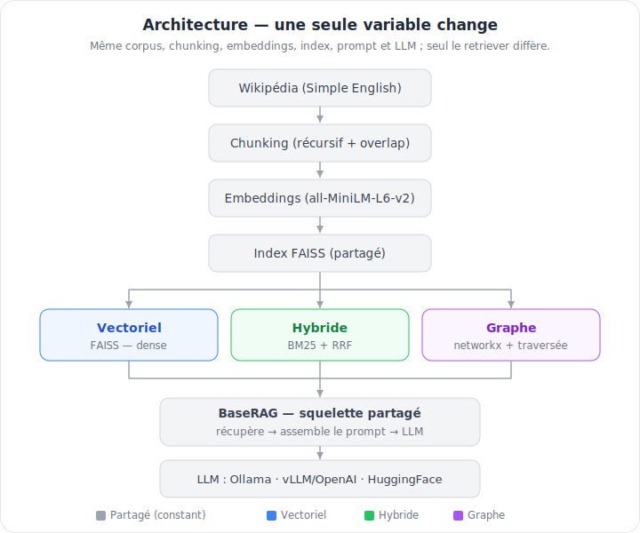
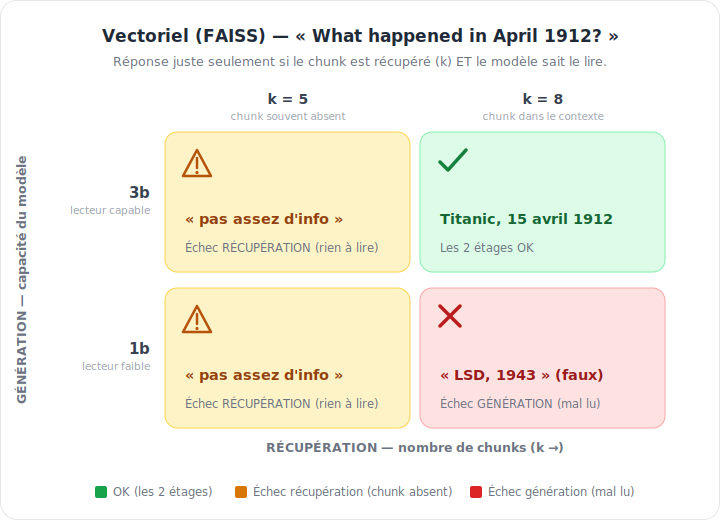
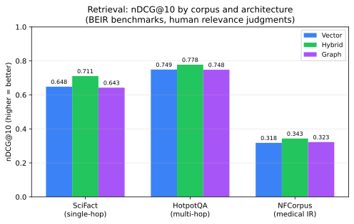
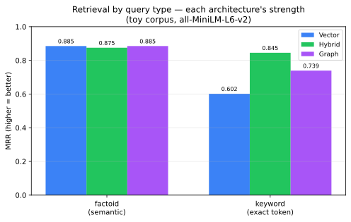
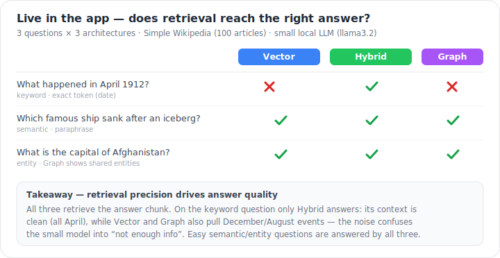

<div align="center">

<pre>
██████╗  █████╗  ██████╗ 
██╔══██╗██╔══██╗██╔════╝ 
██████╔╝███████║██║  ███╗
██╔══██╗██╔══██║██║   ██║
██║  ██║██║  ██║╚██████╔╝
╚═╝  ╚═╝╚═╝  ╚═╝ ╚═════╝ 
</pre>

**Three RAG architectures, compared fairly.**

`Vector` · `Hybrid (BM25 + RRF)` · `Graph` — same corpus · chunking · prompt · LLM


[](LICENSE)
[](https://github.com/gyom15/rag-vector-hybrid-graph/actions)

[Architecture](#architecture) · [Quickstart](#quickstart) · [Evaluation](#evaluation) · [Roadmap](#roadmap)

</div>

---

Comparative study of three **Retrieval-Augmented Generation** architectures on the
**same corpus, chunking, prompt and LLM** — only the *retrieval strategy* changes,
so the comparison is fair (controlled variables).

| Stack | Retrieval | What it adds |
|------|-----------|--------------|
| **Vector** | dense similarity (FAISS) | semantic meaning |
| **Hybrid** | vector + BM25, fused by **RRF** | exact keywords (dates, names, codes) |
| **Graph** | spaCy NER → entity graph (networkx) + **local-search** (query entities via MENTIONS/RELATED_TO, IDF-weighted) | relational / multi-hop |

## Architecture



Only the **retriever** differs between stacks; chunking, embeddings, FAISS index,
prompt and LLM are shared. `pipeline.build_stacks()` is the single source of truth
used by both the app and the benchmark.

## A RAG answer has two stages

A wrong answer can come from **retrieval** (the right chunk never reaches the
context) *or* from **generation** (the chunk is there but the model misreads it).
Both must succeed — the matrix below shows why raising `k` alone or upgrading the
model alone is not enough:



## Project structure

```
rag-vector-hybrid-graph/
├── src/
│   ├── shared/
│   ├── stack1_traditional/
│   ├── stack2_hybrid/
│   ├── stack3_graphrag/
│   └── pipeline.py
├── eval/
├── app/
├── tests/
└── docs/
```

`src/` is the library (shared core + the 3 stacks + `pipeline`), `eval/` the
benchmark, `app/` the Streamlit dashboard.

## Quickstart

### 1. Install

```bash
python3.11 -m venv .venv && source .venv/bin/activate
pip install -e .                 # core: library + Streamlit app
pip install -e ".[eval]"         # + RAGAS benchmark
pip install -e ".[dev]"          # + pytest / ruff
python -m spacy download en_core_web_sm   # NER model used by the graph stack
```

### 2. Pick an LLM backend

Generation needs an LLM, selected by `LLM_PROVIDER` (copy `.env.example` → `.env`):

| Provider | Env vars | Model type | When |
|---|---|---|---|
| `ollama` *(default)* | `OLLAMA_URL`, `OLLAMA_MODEL` | decoder LLM (llama3.2…) | local dev |
| `openai` | `OPENAI_BASE_URL`, `OPENAI_API_KEY`, `OPENAI_MODEL` | decoder LLM | OpenAI **or a vLLM server** |
| `huggingface` | `HF_MODEL` | **seq2seq only** (flan-t5…) | self-contained, no server |

```bash
ollama pull llama3.2:3b          # set OLLAMA_MODEL=llama3.2:3b
```

> `OPENAI_API_KEY` is also the **RAGAS** judge for the benchmark, whatever the
> generation backend.

### 3. Run the app

```bash
streamlit run app/streamlit_app.py
```
- **💬 Chat** — one question to the 3 architectures side by side, each with its own
  thread, latency and sources.
- **📊 Benchmark** — run the evaluation in-app (questions / `k` / OpenAI key) or view
  the last `eval/results.json`. Grouped charts compare quality and latency, overall
  and per question category.

### 4. Reproduce the evaluation

Retrieval quality on standard IR benchmarks — **no LLM**, human relevance judgments:

```bash
python -m eval.beir_eval --dataset scifact --output eval/beir_results.json                                 # single-hop
python -m eval.beir_eval --dataset hotpotqa-distractor --max-queries 500 --output eval/beir_hotpot.json     # multi-hop
python -m eval.beir_eval --dataset nfcorpus --output eval/beir_nfcorpus.json                               # medical IR (hard)
python -m eval.beir_eval --dataset scifact --embedder BAAI/bge-small-en-v1.5 --output eval/beir_scifact_bge.json  # embedder swap
python -m eval.retrieval_eval                                                                              # toy corpus + per-type
python -m eval.plot_benchmark                                                                              # → docs/benchmark-results.svg
```

Generation quality (RAGAS) — needs `OPENAI_API_KEY` as the judge:

```bash
python -m eval.benchmark --questions 15
```

## Evaluation

**Retrieval is evaluated without an LLM** — we measure whether each architecture
*retrieves the relevant documents*, using human relevance judgments (qrels) from
standard IR benchmarks. This isolates the retriever (immune to the LLM's memory),
is deterministic, and needs no API key. Metrics are pure, unit-tested functions
(`shared/ir_metrics.py`):

- **recall@k** — fraction of relevant docs found in the top-k.
- **nDCG@10** — top-10 ranking quality (rewards relevant docs ranked higher); the standard BEIR metric.
- **MRR** — 1 / rank of the first relevant doc.

**Datasets** (loaded from HuggingFace, each with its own human qrels):

- **BEIR** — a standard suite of information-retrieval benchmarks (each = a corpus + queries + relevance judgments).
- **SciFact** — scientific *claim verification*: ~5k abstracts, 300 queries; **single-hop** (the answer lives in one document).
- **HotpotQA** (distractor) — **multi-hop** QA: each question needs **≥2 documents combined**; we rank the supporting paragraphs among distractors.
- **NFCorpus** — a **medical/nutrition** IR benchmark (~3.6k docs) with many graded-relevant docs per query; a known-*hard* dataset where absolute scores are low for every retriever.
- **qrels** — the human *relevance judgments*: for each query, which documents count as relevant. Metrics score the retrieved ranking against them.

### Results — nDCG@10 (human qrels)



| nDCG@10 (MiniLM) | SciFact (single-hop) | HotpotQA (multi-hop) | NFCorpus (medical IR) |
|---|---|---|---|
| **Hybrid** (BM25 + dense + RRF) | **0.711** | **0.778** | **0.343** |
| Vector (FAISS, MiniLM) | 0.648 | 0.749 | 0.318 |
| Graph (spaCy + local-search) | 0.591 | 0.484 | 0.310 |

**Takeaway:** the **hybrid** retriever is the robust winner on *all three* corpora —
consistent with the BEIR literature (MiniLM ≈ 0.64, BM25 ≈ 0.665; RRF fusion lifts
to 0.711). NFCorpus is a deliberately hard benchmark (many graded-relevant docs per
query → low absolute nDCG for everyone), yet the ranking holds. The lightweight
entity-graph underperforms on standard IR (its additive entity boost adds noise on
large corpora); the real GraphRAG advantage needs LLM-extracted relations + community
summaries, out of scope here. No free lunch — and showing it *honestly* on standard
benchmarks is the point.

Reproduce with [Quickstart §4](#4-reproduce-the-evaluation).

### Embedder sensitivity

The retriever isn't tied to one embedder. Swapping MiniLM → **bge-small-en-v1.5** on SciFact:

| nDCG@10 (SciFact) | MiniLM | bge-small | Δ |
|---|---|---|---|
| **Hybrid** | **0.711** | **0.726** | +0.015 |
| Vector | 0.648 | 0.706 | +0.058 |
| Graph | 0.591 | 0.646 | +0.055 |

A stronger dense model lifts everyone, but the **dense-only** stacks (Vector, Graph) gain
most (~+0.06) while Hybrid barely moves (+0.015) — BM25 already supplied the lexical signal
the better embedder adds. Hybrid still wins: the embedder is a knob, not the verdict.

### By query type — where each architecture shines

On a tagged set (factoid = paraphrased semantic, keyword = exact token), each
architecture shows a distinct character (toy corpus, MRR):



| MRR | factoid (semantic) | keyword (exact token) |
|---|---|---|
| **Vector** | **0.885** | 0.602 |
| **Hybrid** | 0.875 | **0.845** |
| **Graph** | 0.854 | 0.830 |

- **Vector** — *semantic specialist*: best on factoid, but collapses on keyword (no lexical matching).
- **Hybrid** — *robust generalist*: wins keyword, near-best on factoid (why it tops the aggregate).
- **Graph** — *entity-robust*: spaCy NER recovers named-entity keyword queries (0.830) far better than pure Vector (0.602), without BM25.

> Small/easy corpus → indicative of *character*, not a ranking; the rigorous
> ranking is the BEIR table above.

### Seen live in the app

End-to-end, the same effect appears. Asked in the app (Simple Wikipedia, 500 articles,
small local LLM), retrieval — which is deterministic — decides the answer. On the
**keyword** query (*"April 1912"*) only **Hybrid** keeps a clean context (3/5 chunks on
the right month) and answers *Titanic*; Vector and Graph grab a noisier April and misread
it as *"LSD, 1943"*. On the **entity** query (*"capital of Afghanistan"*) Vector and Hybrid
retrieve 5/5 on-topic, but the **entity-graph pulls unrelated entities** (June, China,
Islamic world) — only 2/5 on-topic — and fails. The live demo mirrors the BEIR table:
**Hybrid robust, the entity boost adds noise on the larger corpus** (and it motivates
measuring generation directly — see [Roadmap](#roadmap)).



### Generation quality (optional)

`eval/questions.json` (40 questions tagged factoid / keyword / multi) drives a RAGAS
benchmark of answer quality (faithfulness, relevancy, context precision/recall) —
in the app's Benchmark tab or via `python -m eval.benchmark`. RAGAS uses an OpenAI
judge → needs `OPENAI_API_KEY`; without it only latencies are reported.

## Roadmap

Planned, not yet implemented:

- **Generation quality** — measure end-to-end answers (exact-match / F1 on HotpotQA gold answers, via the local LLM) to confirm whether *better retrieval → better answers*.
- **Serving at scale** — **vLLM** (PagedAttention, continuous batching) behind an OpenAI-compatible API, orchestrated by **Ray** (autoscaled replicas, Ray Data batch inference). Reachable through the existing `openai` provider with no code change — and it doubles as the remote LLM for a hosted demo.
- **Hosted demo** — a retrieval-first Streamlit demo on HF Spaces (generation wired to the vLLM endpoint above).
- **Breadth** — stronger embedders (bge/e5) on the BEIR datasets, plus more datasets (NFCorpus, FiQA).

## Tests

```bash
pytest -q
```
Cover the pure logic (chunking, RRF fusion, BM25 tokenizer, IR metrics) with only
light deps (snowballstemmer, spaCy) — no torch/faiss — keeping CI fast.

## Data

[Simple English Wikipedia](https://huggingface.co/datasets/wikimedia/wikipedia)
(`20231101.simple`), first 500 articles by default (`--articles` to change).

## License

[MIT](LICENSE) — see the `LICENSE` file.
