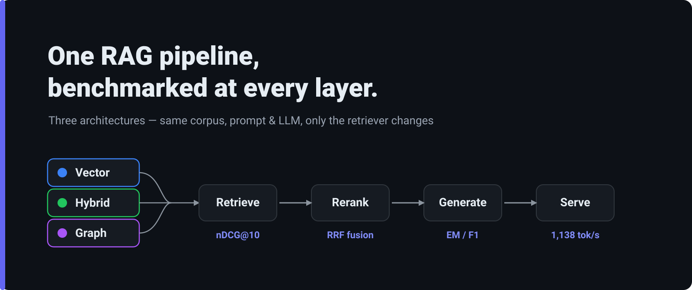
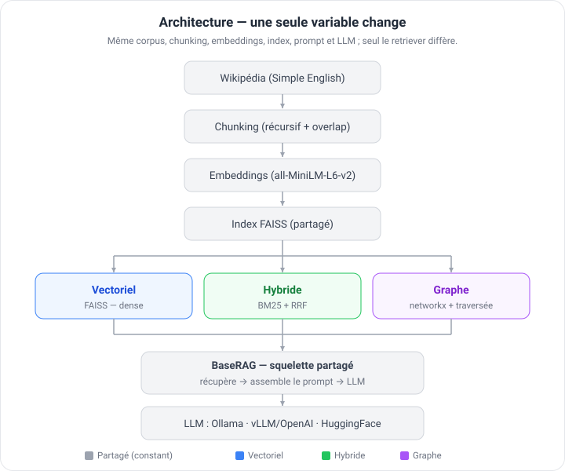
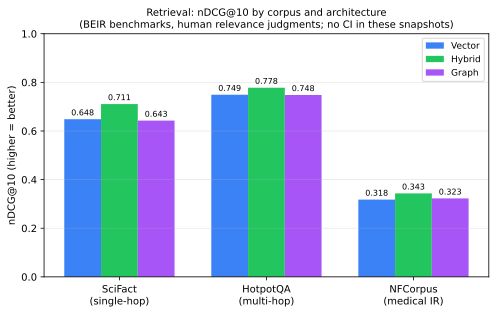
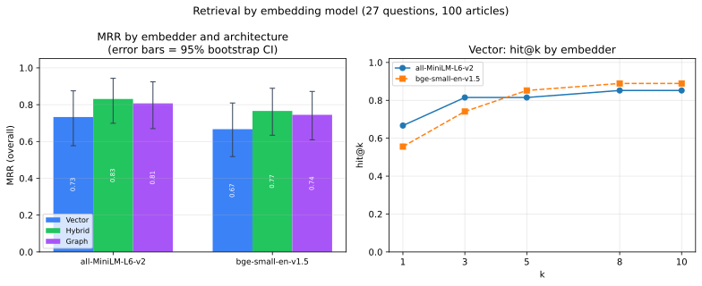
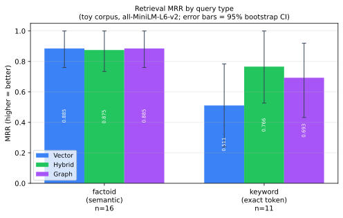
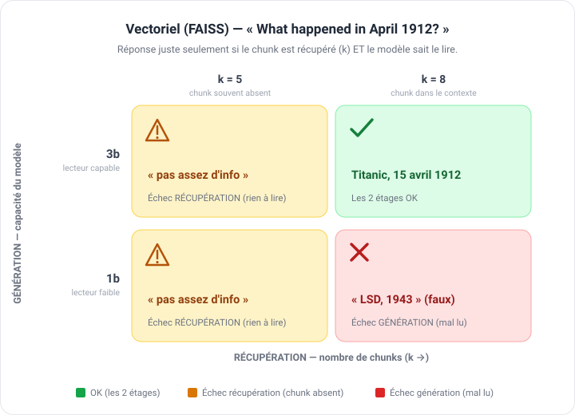
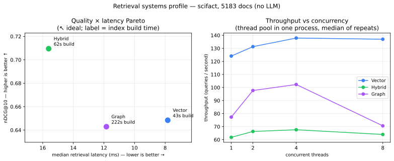
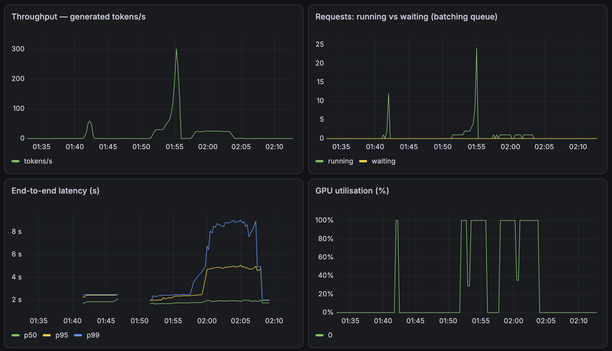
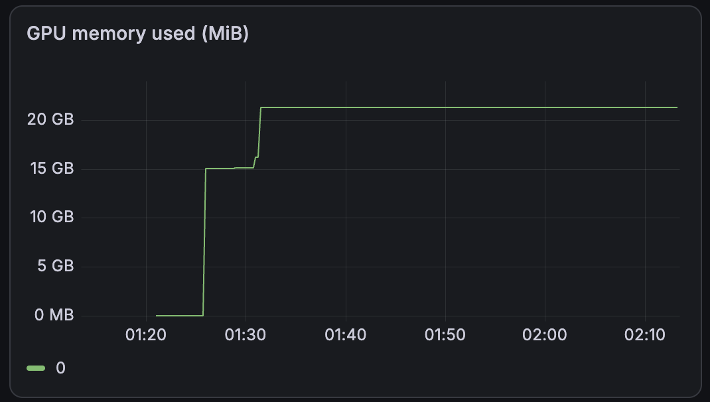

<div align="center">



<br/>
<br/>


[](LICENSE)
[](https://github.com/GYOM15/rag-vector-hybrid-graph/actions)
[](https://huggingface.co/spaces/gyom15/rag-vector-hybrid-graph)

[**Live demo**](https://huggingface.co/spaces/gyom15/rag-vector-hybrid-graph) · [Contents](#contents)

</div>

---

A benchmark of three retrieval-augmented generation (RAG) architectures — **Vector**,
**Hybrid** and **Graph** — built so that **only the retriever changes**: same corpus,
chunking, embeddings, prompt and LLM. The same pipeline is then measured at every layer:
retrieval quality (BEIR SciFact and NFCorpus, HotpotQA), reranking, end-to-end answers,
CPU systems cost, and GPU serving with vLLM. Reported numbers come from committed JSON
snapshots: post-audit snapshots carry the git SHA of the code that produced them, and all
but the tuning sweep and the CPU benchmark carry 95% confidence intervals. Pre-audit
figures, kept for the story and not re-run, are marked †.

## Contents

- [Key results](#key-results)
- [Live demo](#live-demo)
- [Architecture](#architecture)
- [Quickstart](#quickstart)
- [Evaluation methodology](#evaluation-methodology)
- [Results](#results)
  - [Retrieval quality](#retrieval-quality)
  - [Debugging the Graph](#debugging-the-graph)
  - [Embedder sensitivity](#embedder-sensitivity)
  - [By query type](#by-query-type)
  - [Reranking](#reranking)
  - [From retrieval to answers](#from-retrieval-to-answers)
    - [What moves answer quality](#what-moves-answer-quality)
  - [Performance and systems](#performance-and-systems)
  - [Serving on AWS (pre-audit)](#serving-on-aws-pre-audit)
- [Audit (2026-09)](#audit-2026-09)
- [Tests and CI](#tests-and-ci)
- [Security and limitations](#security-and-limitations)
- [Roadmap](#roadmap)
- [Data](#data)
- [License](#license)

## Key results

- **Retrieval (SciFact, NFCorpus, HotpotQA; human relevance judgments, no LLM).**
  Hybrid — BM25 and dense retrieval fused by RRF — has the best nDCG@10 on all three
  corpora and beats Vector significantly on each. → [Retrieval quality](#retrieval-quality)
- **The Graph was held back twice by scoring bugs:** entity-rich hub documents swamped its
  boost, then chunks reached only through the graph were scored with a cosine of 0. Fixed,
  it beats Vector on multi-hop HotpotQA (level with Hybrid there) and narrowly on
  NFCorpus, but not on SciFact. → [Debugging the Graph](#debugging-the-graph)
- **Reranking: replace or fuse? It depends on the data.** Letting the cross-encoder's
  ranking replace the retriever's wins on HotpotQA for every stack; on SciFact it hurts
  Hybrid and fusing is the safe mode; on NFCorpus the two modes tie. → [Reranking](#reranking)
- **With a short-answer prompt, better retrieval shows up in the Llama models' answers.**
  Under that prompt, Hybrid — which most often puts both supporting paragraphs in the
  context — beats Vector on answer F1 with both Llama models (not with Qwen); the Graph,
  whose retrieval on that sample matches Vector's, answers like Vector.
  → [From retrieval to answers](#from-retrieval-to-answers)
- **The prompt is part of the system.** Asked for the shortest span, llama3.2:3b's answers
  shrink from 13.4 to 1.7 tokens and its F1 moves from 0.134–0.184 to 0.495–0.599. Part
  of that is scoring: token-F1 penalizes correct but verbose answers. Part is behavior:
  the default prompt's "not enough information" escape hatch makes the Llama models refuse
  many questions whose supporting paragraphs they had in context.
  → [What moves answer quality](#what-moves-answer-quality)
- **A smaller reader can read better.** In free-form answers Qwen2.5-1.5B contains the
  gold more often than llama3.2:3b, though not in terse ones.
  → [What moves answer quality](#what-moves-answer-quality)
- **The Graph costs ~5× Vector to build**, most of it spaCy NER, and Hybrid is the
  slowest to query. Extra threads help the Graph most, and no stack gains beyond 4.
  → [Performance and systems](#performance-and-systems)
- **vLLM on one A10G: 38.6× the tokens/s from 1 to 64 concurrent requests**
  (Qwen2.5-7B-Instruct), for +0.4 s of median latency, split about evenly between time to
  first token and slower decoding. Measured before the audit, and unaffected by it.
  → [Serving on AWS](#serving-on-aws-pre-audit)
- **A self-audit (2026-09)** closed the public demo's API-key exposure and multi-user
  state leaks, fixed five retrieval bugs, and rebuilt the evaluation around CIs, paired
  tests, provenance and a regression guard that can actually fail. → [Audit](#audit-2026-09)

## Live demo

**[Try it on Hugging Face Spaces](https://huggingface.co/spaces/gyom15/rag-vector-hybrid-graph)**
(free CPU Space, generation by Qwen2.5-1.5B-Instruct):

- **Live chat** — one question goes to all three stacks; each column keeps its own thread
  and shows the answer, latency and retrieved sources.
- **Evaluation** — a dashboard over the committed snapshots in [`eval/reference/`](eval/reference):
  retrieval quality, reranking, systems and answer quality, with CIs and paired tests where
  the snapshot has them. Captions are computed from the data, not written by hand. Two
  light evals run live — the regression guard and retrieval by question type. The live
  RAGAS tab is disabled on the public Space.

Every visitor shares one process, so the Space runs in public-demo mode: the LLM backend
is fixed by the server ([Security and limitations](#security-and-limitations)). To deploy
your own, see [docs/DEPLOY-HF.md](docs/DEPLOY-HF.md).

## Architecture



| Stack | Retrieval | What it adds |
|---|---|---|
| **Vector** | FAISS exact inner product over L2-normalized MiniLM embeddings (cosine) | semantic similarity |
| **Hybrid** | vector top-20 and BM25 top-20 (only chunks containing a query term), fused by RRF (k = 60) | exact tokens: names, dates, codes |
| **Graph** | 20 vector seeds + chunks linked to the query's spaCy entities (MENTIONS, 1-hop RELATED_TO); score = cosine + 0.3 × IDF-weighted entity overlap ÷ the chunk's entity count | named-entity links |

Chunking, embeddings, the FAISS index, the prompt and the LLM are shared;
`pipeline.assemble_stacks()` builds the three stacks for the app and the evals (the perf
bench instantiates the same retrievers itself, to time each build step).
An optional cross-encoder stage wraps any retriever (top-30 → rerank → top-k): set
`RERANK_MODE=replace` or `fusion`. It is **off by default**, because its benefit depends
on the data ([Reranking](#reranking)).

```
src/
  shared/              chunking, embeddings, FAISS index, LLM backends, prompt, metrics, reranker
  stack1_traditional/  Vector
  stack2_hybrid/       Hybrid (BM25 tokenizer, RRF)
  stack3_graphrag/     Graph (spaCy NER, entity graph, local search)
  pipeline.py          builds the three stacks
eval/                  eval scripts, question sets, golden corpus, reference/ snapshots
app/                   Streamlit app and evaluation dashboard
tests/                 pytest suite
docs/                  figures, deployment guide
```

## Quickstart

### 1. Install

```bash
python3.11 -m venv .venv && source .venv/bin/activate
pip install -e ".[dev]"                   # library + app + pytest/ruff
pip install -e ".[notebooks]"             # + matplotlib, to regenerate the figures
pip install -e ".[eval]"                  # + RAGAS (optional)
python -m spacy download en_core_web_sm   # NER model used by the Graph
```

### 2. Choose an LLM backend

Generation needs an LLM, chosen by `LLM_PROVIDER`. Copy `.env.example` to `.env`: the app
and the RAGAS benchmark load it; the other eval scripts read the shell environment.

| `LLM_PROVIDER` | Settings | Model | Use |
|---|---|---|---|
| `ollama` (default) | `OLLAMA_URL`, `OLLAMA_MODEL` | decoder LLM, e.g. `llama3.2:3b` | local development, answer eval |
| `openai` | `OPENAI_BASE_URL`, `OPENAI_API_KEY`, `OPENAI_MODEL` | any OpenAI-compatible endpoint | OpenAI, or a vLLM server |
| `huggingface` | `HF_MODEL` | seq2seq (flan-t5) or instruct decoder (Qwen2.5…), auto-detected | no server; the hosted demo |

```bash
ollama pull llama3.2:3b
```

Other settings: `RERANK_MODE` (`replace` | `fusion`, off by default), `DEMO_ARTICLES`
(app corpus size, default 500), `LLM_TIMEOUT` (seconds, default 120), `PUBLIC_DEMO`
([Security and limitations](#security-and-limitations)). `OPENAI_API_KEY` also
authenticates the RAGAS judge, whatever the generation backend.

### 3. Run the app

```bash
streamlit run app/streamlit_app.py
```

The first chat or live eval builds the index (cached afterwards); the dashboard itself
only reads JSON and loads immediately.

### 4. Reproduce the evaluation

Each command writes its committed snapshot under `eval/reference/`, the files this README,
the dashboard and the plot scripts read. Without `--output`, a script writes a gitignored
scratch file under `eval/` that neither the dashboard nor the plots read; the one
exception is the RAGAS benchmark's `eval/results.json`, which the app's RAGAS tab shows.
Datasets download from Hugging Face on first use.

```bash
# Retrieval quality: SciFact, NFCorpus, HotpotQA distractor (no LLM)
python -m eval.beir_eval --dataset scifact  --output eval/reference/beir_scifact.json
python -m eval.beir_eval --dataset nfcorpus --output eval/reference/beir_nfcorpus.json
python -m eval.beir_eval --dataset hotpotqa-distractor --max-queries 500 --output eval/reference/beir_hotpotqa.json
python -m eval.beir_eval --dataset scifact --embedder BAAI/bge-small-en-v1.5 --output eval/reference/beir_scifact_bge.json

# Graph entity normalization, selected on held-out splits
python -m eval.sweep_entity_norm --output eval/reference/sweep_entity_norm.json

# Reranking, replace vs fuse (first 100 test queries each; HotpotQA on the 500-question corpus)
python -m eval.rerank_eval --dataset scifact  --candidates 30 --max-queries 100 --output eval/reference/rerank_scifact.json
python -m eval.rerank_eval --dataset nfcorpus --candidates 30 --max-queries 100 --output eval/reference/rerank_nfcorpus.json
python -m eval.rerank_eval --dataset hotpotqa-distractor --candidates 30 --max-queries 100 \
    --corpus-questions 500 --output eval/reference/rerank_hotpotqa.json

# Retrieval by question type (toy Wikipedia set, MiniLM and bge-small)
python -m eval.retrieval_eval --articles 100 --output eval/reference/retrieval_results.json

# Systems: build cost, latency, throughput (no LLM; use a quiet machine)
python -m eval.perf_bench --dataset scifact --n-queries 200 --output eval/reference/perf_scifact.json
```

Answer quality needs Ollama (`LLM_PROVIDER=ollama`; `--model` sets `OLLAMA_MODEL`) with
`llama3.2:1b`, `llama3.2:3b` and `qwen2.5:1.5b` pulled:

```bash
python -m eval.answer_eval --max-queries 100 --model llama3.2:1b  --prompt default --output eval/reference/answer_1b.json
python -m eval.answer_eval --max-queries 100 --model llama3.2:1b  --prompt short   --output eval/reference/answer_1b_short.json
python -m eval.answer_eval --max-queries 100 --model llama3.2:3b  --prompt default --output eval/reference/answer_3b.json
python -m eval.answer_eval --max-queries 100 --model llama3.2:3b  --prompt short   --output eval/reference/answer_3b_short.json
python -m eval.answer_eval --max-queries 100 --model qwen2.5:1.5b --prompt default --output eval/reference/answer_qwen1.5b.json
python -m eval.answer_eval --max-queries 100 --model qwen2.5:1.5b --prompt short   --output eval/reference/answer_qwen1.5b_short.json
```

The script reports each run's metrics and its stack-vs-stack tests. Refusal rates and the
comparisons across runs (model against model, prompt against prompt) are computed from
the saved generations, paired per question and averaged over the three stacks, for
example:

```python
import json
from eval.stats import paired_bootstrap

def pooled(run, score):  # one value per question, averaged over the three stacks
    rows = json.load(open(f"eval/reference/answer_{run}.json"))["per_query"]
    return [sum(score(q["stacks"][s]) for s in ("Vector", "Hybrid", "Graph")) / 3 for q in rows]

def refused(r):  # the refusal rule of "From retrieval to answers"
    a = r["answer"].strip().lower()
    return float("enough information" in a or a.startswith("unknown"))

contains = lambda r: r["contains"]
paired_bootstrap(pooled("qwen1.5b", contains), pooled("3b", contains))  # Qwen − 3B, default prompt
sum(pooled("3b", refused)) / 100  # llama3.2:3b's refusal rate, default prompt
```

The supporting-paragraph shares also need HotpotQA's `supporting_facts`, from the
dataset itself.

GPU serving, against any OpenAI-compatible endpoint (to run the answer eval there too,
set `LLM_PROVIDER=openai`, `OPENAI_BASE_URL` and `OPENAI_MODEL`):

```bash
python -m eval.serving_bench --base-url http://<host>:8000/v1 --model Qwen/Qwen2.5-7B-Instruct \
    --n-prompts 64 --max-tokens 96 --output eval/reference/serving_aws.json
```

Figures, replotted from the snapshots:

```bash
python -m eval.plot_benchmark    # beir_{scifact,hotpotqa,nfcorpus}.json → docs/benchmark-results.svg
python -m eval.plot_perf         # perf_scifact.json → docs/perf-pareto.svg
python -m eval.plot_categories   # retrieval_results.json → docs/per-category.svg
python -m eval.plot_retrieval    # retrieval_results.json → docs/retrieval-embedders.svg
```

Optional RAGAS benchmark (needs `OPENAI_API_KEY` as the judge; writes `eval/results.json`,
which the app's RAGAS tab shows):

```bash
python -m eval.benchmark
```

> On macOS, if faiss and torch abort over duplicate OpenMP runtimes, run the evals with
> `KMP_DUPLICATE_LIB_OK=TRUE` (the test suite sets it for itself).

## Evaluation methodology

**Retrieval is evaluated without an LLM.** Each stack ranks documents, and the ranking is
scored against human relevance judgments (qrels). This isolates the retriever from the
model's memory, is deterministic, and needs no API key.

| Dataset | Corpus | Queries | Relevant | Role |
|---|---|---|---|---|
| **SciFact** (BEIR) | 5,183 abstracts | 300 (test) | abstracts supporting the claim | single-hop |
| **NFCorpus** (BEIR) | 3,633 documents | 323 (test) | many, graded | medical; hard for every retriever |
| **HotpotQA** distractor (validation) | 4,937 paragraphs: the 10 of each of the first 500 questions | 500 | the 2 gold paragraphs | multi-hop |
| **Simple English Wikipedia** | 100 articles, 500-character chunks | 27 hand-written: 16 factoid, 11 keyword | a gold phrase in the source article | behavior by question type |
| **Golden corpus** | 40 documents | 18: 8 easy, 5 lexical probes, 5 entity probes | hand-labeled | CI regression guard |

On BEIR and HotpotQA each document is one retrieval unit (no chunking).

**Metrics.** nDCG@10 is the primary retrieval metric (the BEIR standard), with recall@k
and MRR alongside; the toy set reports hit@k and MRR; the guard uses nDCG@5. Answers are
scored against gold answers without an LLM judge: EM and F1 (SQuAD-style), *contains*,
mean answer length and refusal rate ([From retrieval to answers](#from-retrieval-to-answers)).
Systems: latency percentiles and throughput; serving: requests/s, tokens/s, TTFT, TPOT.

**Uncertainty.** The retrieval (BEIR and HotpotQA), per-type, reranking and answer evals
report means with a 95% percentile bootstrap CI (10,000 resamples of the queries, fixed
seed, so reruns reproduce the interval exactly). All but the per-type eval also keep their
per-query scores, so two stacks are compared on the *same* queries with a paired test: a
bootstrap CI of the mean per-query difference and a two-sided sign-flip permutation
p-value ([`eval/stats.py`](eval/stats.py)). Pairing cancels out query difficulty, so it
detects gaps that two overlapping CIs would hide. The sweep and perf snapshots have
neither CIs nor per-query scores. Tables show `mean [lo, hi]`; paired differences show
`Δ [lo, hi], p`.

**Provenance.** Each snapshot records, under `config.provenance`, the git SHA at the start
of the run, whether the checkout was dirty (with the changed files and a fingerprint of the
diff), start and finish times, Python and platform, and the versions of every library that
can move a score (faiss, sentence-transformers, torch, transformers, spaCy and its model,
rank-bm25, numpy, networkx, datasets). `code_changed_during_run` flags a checkout that
moved mid-run. Snapshots without provenance predate the audit, and the dashboard says so.

**Held-out selection.** The only tuned knob — the Graph's entity normalization — is chosen
on validation splits (SciFact-train, NFCorpus-validation); test splits are reported, never
used to choose. HotpotQA's public labels stop at its validation split, which therefore
serves only as a test set. The other constants were not tuned: 20 vector seeds, graph
weight 0.3 and RELATED_TO discount 0.5 in the Graph, fusion depth 20 and RRF k = 60 in the
Hybrid.

**Determinism and snapshots.** Generation is greedy (temperature 0). Results live in
[`eval/reference/`](eval/reference); the figures are replotted from those files and the
dashboard computes its captions from them, so a rerun cannot leave a stale conclusion
behind.

## Results

### Retrieval quality



| nDCG@10 [95% CI] | SciFact (single-hop) | NFCorpus (medical) | HotpotQA (multi-hop) |
|---|--:|--:|--:|
| **Vector** | 0.648 [0.603, 0.694] | 0.318 [0.284, 0.352] | 0.749 [0.729, 0.770] |
| **Hybrid** | **0.710** [0.666, 0.752] | **0.346** [0.311, 0.381] | **0.778** [0.759, 0.796] |
| **Graph** | 0.643 [0.598, 0.687] | 0.323 [0.289, 0.358] | 0.771 [0.752, 0.789] |

Paired differences on the same queries (Δ nDCG@10 [95% CI], sign-flip p):

| | SciFact | NFCorpus | HotpotQA |
|---|--:|--:|--:|
| Hybrid − Vector | +0.061 [0.040, 0.083], p < 0.001 | +0.028 [0.015, 0.042], p < 0.001 | +0.029 [0.015, 0.042], p < 0.001 |
| Graph − Vector | −0.005 [−0.020, 0.009], p = 0.47 | +0.005 [0.001, 0.010], p = 0.020 | +0.021 [0.011, 0.032], p < 0.001 |
| Graph − Hybrid | −0.067 [−0.088, −0.045], p < 0.001 | −0.023 [−0.036, −0.010], p < 0.001 | −0.007 [−0.021, 0.007], p = 0.30 |

Hybrid leads on all three corpora, and its lead over Vector is significant on each. The
Graph is not distinguishable from Vector on SciFact, slightly but significantly ahead on
NFCorpus, and clearly ahead on HotpotQA; it stays significantly below Hybrid on SciFact
and NFCorpus, and is within noise of it on HotpotQA.
For reference, BEIR's published BM25 baseline on SciFact is 0.665 (Thakur et al., 2021).
NFCorpus is hard by design: many graded-relevant documents per query keep absolute nDCG
low for every retriever.

> **Why HotpotQA numbers differ between sections.** HotpotQA distractor has no fixed
> corpus: each eval builds one from the 10 paragraphs (2 gold, 8 distractors) of the
> questions it samples. It is not BEIR's HotpotQA, so these scores are not comparable with
> published BEIR ones. This table uses the first 500 questions (4,937 paragraphs). The
> reranking eval scores the first 100 of those questions on the same corpus, so its
> baseline is a subsample of this one (Vector 0.747 on those 100, 0.749 on all 500), as it
> is on the other corpora ([Reranking](#reranking)). The answer eval builds its own corpus
> from its 100 questions (991 paragraphs): far fewer distractors, so its nDCG@10 is higher
> (Vector 0.789) and not comparable with this table.

### Debugging the Graph

The Graph started as the weakest stack. Twice, the cause was a bug in how it scored
chunks rather than a limit of the idea.

**Chapter 1 — hub documents.** The first Graph scored 0.484† nDCG@10 on HotpotQA, far
below the others. Its score added an *unnormalized* sum of entity-overlap IDF, so
entity-rich "hub" documents collected a huge boost. On *"capital of Afghanistan?"*
(500-article Wikipedia corpus), the top hit was the *June* calendar page — 53 entities†
and zero similarity to the query, tied to Afghanistan through the dozens of countries it
cites. That noise grows with the corpus, which is exactly where a graph should help.

The fix divides the entity boost by f(n), where n is the chunk's number of entities — the
idea behind BM25's length normalization: a focused chunk beats a promiscuous hub. f is the
one knob, chosen on held-out splits; n^0.75 ("p75") won validation, 0.001† ahead of
linear.

| Graph nDCG@10, test split | no normalization† | p75† |
|---|--:|--:|
| SciFact | 0.591 | 0.643 |
| NFCorpus | 0.310 | 0.323 |
| HotpotQA | 0.484 | 0.748 |

**Chapter 2 — the audit's scoring bug.** Only the top-20 vector seeds had a cosine similarity.
A chunk reached *only* through the graph scored 0 + 0.3 × boost, so the graph signal
could rarely lift a chunk into the top-k, and the top-10 changed with k. (The June page's
"zero similarity" in chapter 1 was almost certainly this placeholder 0, not a measured
cosine.) Every candidate now gets its real cosine plus the boost, so the result is the
exact top-k of one score over the whole corpus, stable in k.

That changes what the normalization has to correct, so the held-out sweep was re-run
([`sweep_entity_norm.py`](eval/sweep_entity_norm.py)). Selection uses the first column
only:

| f(n) | validation mean nDCG@10 (SciFact-train, NFCorpus-validation) | SciFact test | NFCorpus test | HotpotQA |
|---|--:|--:|--:|--:|
| none (1) | 0.4449 | 0.5745 | 0.3087 | 0.4813 |
| p25 (n^0.25) | 0.4564 | 0.5969 | 0.3099 | 0.5283 |
| log (1 + ln n) | 0.4757 | 0.6218 | 0.3156 | 0.6133 |
| sqrt (n^0.5) | 0.4771 | 0.6221 | 0.3157 | 0.6639 |
| p75 (n^0.75) | 0.4881 | 0.6430 | 0.3212 | 0.7561 |
| **linear (n)** — chosen | **0.4884** | **0.6429** | **0.3233** | **0.7705** |

Linear leads p75 by 0.0003 on validation — a tie in practice — but the rule is "best
validation mean", so the default moved from p75 to linear. The test columns agree without
having been consulted: the two tie on SciFact, and linear leads on NFCorpus and HotpotQA.
On HotpotQA the Graph went from 0.7481† (p75, with the bug) to 0.7705: +0.008 from the
scoring fix alone (p75: 0.7561), +0.014 from the switch to linear. SciFact (0.6426† →
0.6429) and NFCorpus (0.3226† → 0.3233) barely moved: the fix matters where the graph
reaches chunks the vector seeds miss, which is multi-hop HotpotQA. Normalization still
matters as much as in chapter 1: without it, HotpotQA falls to 0.4813.

**What the Graph still is not.** It leads on no corpus
([Retrieval quality](#retrieval-quality)). Its one clear gain over Vector (+0.021) is on
multi-hop HotpotQA, the corpus where the chapter 2 fix mattered. That is consistent with
entity links reaching a second paragraph the vector seeds miss, but no ablation here
isolates it. On single-hop SciFact it matches Vector at a much higher build cost
([Performance and systems](#performance-and-systems)). A real GraphRAG advantage would
need LLM-extracted typed relations and community summaries, which are out of scope.

### Embedder sensitivity

SciFact with `all-MiniLM-L6-v2` replaced by `BAAI/bge-small-en-v1.5`, everything else fixed:

| nDCG@10 (SciFact) | MiniLM | bge-small | Δ |
|---|--:|--:|--:|
| **Vector** | 0.648 | 0.706 [0.662, 0.749] | +0.057 |
| **Hybrid** | 0.710 | 0.725 [0.682, 0.766] | +0.015 |
| **Graph** | 0.643 | 0.690 [0.646, 0.733] | +0.047 |

Paired on the same queries, bge-small lifts Vector (p < 0.001) and the Graph (p < 0.001)
significantly, and Hybrid only within noise (p = 0.14). The order is unchanged (Hybrid,
Vector, Graph), but the gaps close: with bge-small, Hybrid's lead over Vector
(+0.019 [−0.002, 0.039], p = 0.076) and the Graph's deficit to Vector (−0.016, p = 0.14)
are no longer significant; the Graph stays below Hybrid (−0.035, p = 0.0098). One
plausible reading, untested: a stronger dense retriever already finds much of what BM25
added.



> The figure uses the toy Wikipedia set (27 questions, 100 articles): MRR by embedder and
> stack (left) and Vector's hit@k curve per embedder (right). Unlike on SciFact,
> bge-small scores slightly lower there for every stack (MRR −0.06 to −0.07), but with 27
> questions the CIs are wide and overlap; read it as character, not as a ranking.

### By query type

The 27 hand-written questions are tagged **factoid** (paraphrased, so they need semantic
matching) or **keyword** (they hinge on an exact token). MiniLM, 100 articles:

| MRR [95% CI] | factoid (n = 16) | keyword (n = 11) |
|---|--:|--:|
| **Vector** | 0.885 [0.760, 1.000] | 0.511 [0.239, 0.784] |
| **Hybrid** | 0.875 [0.734, 1.000] | 0.766 [0.527, 1.000] |
| **Graph** | 0.885 [0.760, 1.000] | 0.693 [0.432, 0.920] |

Factoid questions do not separate the stacks: all three score 0.875–0.885 with
near-identical intervals. On keyword questions Vector drops to 0.511 while Hybrid and the
Graph hold up better, the direction expected when BM25 or entity links can match the exact
token. The three keyword intervals overlap widely, though (see the caveats below).



**The hit rule.** A retrieved chunk is a hit only if it comes from the question's source
article *and* contains the gold answer as whole words (case-insensitive). Before the
audit, any chunk containing the gold as a substring counted, from any article: for keyword
questions whose gold is the question's own entity, every chunk that merely mentioned it
scored, and "Wright" matched "playwright". `python -m eval.retrieval_eval --check-golds`
verifies that every gold is findable in its article.

**Caveats.** The rule is stricter than before, so these numbers are not comparable with
pre-audit ones. It can also be too strict: a chunk from another article that genuinely
answers the question counts as a miss. With 16 factoid and 11 keyword questions the CIs
are wide, and the snapshot keeps no per-question ranks for a paired test, so this profile
is indicative only: it supports no claim that one stack beats another on exact tokens. The
rigorous ranking is the [retrieval table](#retrieval-quality). The app's *Retrieval by
type (live)* tab applies the same rule to the app's corpus (500 articles by default), so
its numbers differ from this snapshot.

### Reranking

Each retriever returns a top-30; a cross-encoder (`cross-encoder/ms-marco-MiniLM-L-6-v2`)
scores every (query, document) pair and keeps a top-10. Its scores can **replace** the
base ranking, or be **fused** with it by RRF. Each eval scores the first 100 test queries
of its dataset ([`rerank_eval.py`](eval/rerank_eval.py)), so its no-rerank baselines are
a subsample of the retrieval table and differ from it (SciFact Hybrid: 0.777 on these 100,
0.710 on all 300):

| Δ nDCG@10 vs no reranking (paired p) | SciFact | NFCorpus | HotpotQA |
|---|--:|--:|--:|
| Vector · replace | +0.029 (p = 0.27) | +0.027 (p = 0.037) | +0.078 (p < 0.001) |
| Vector · fuse | **+0.039** (p = 0.024) | +0.023 (p = 0.0074) | +0.046 (p < 0.001) |
| Hybrid · replace | **−0.051** (p = 0.019) | +0.024 (p = 0.038) | +0.080 (p < 0.001) |
| Hybrid · fuse | −0.009 (p = 0.48) | +0.019 (p = 0.0080) | +0.047 (p < 0.001) |
| Graph · replace | +0.031 (p = 0.20) | +0.023 (p = 0.067) | **+0.091** (p < 0.001) |
| Graph · fuse | +0.028 (p = 0.088) | +0.021 (p = 0.011) | +0.058 (p < 0.001) |

Replace against fuse, head to head on the same queries:

- **SciFact: fusing is the safe mode.** Replacing lowers Hybrid significantly, and fuse
  beats replace on Hybrid (+0.042, p = 0.0052); on Vector and the Graph the two modes are
  not distinguishable (p ≥ 0.53), and only Vector · fuse is a significant gain. The replace
  scores show why: they converge on the cross-encoder's own quality (0.725–0.731 for all
  three stacks), above Vector's and the Graph's baseline (0.700–0.701) but below Hybrid's
  (0.777).
- **NFCorpus: a tie.** Both modes add about +0.02 on every stack, and they are not
  distinguishable from each other (p ≥ 0.47).
- **HotpotQA: replace wins on every stack**, by +0.031 to +0.033 over fuse (p ≤ 0.0026).

So the winner is shared by all three stacks on HotpotQA, but on SciFact it depends on how
good the base ranking already is.

The trade-off itself is general. *Replace* follows the cross-encoder: it gains most when
the cross-encoder out-ranks the retriever, and loses when it does not. *Fuse* keeps part
of the base ranking, which caps both the loss and the gain. Which one wins is a property
of the data, so the pipeline keeps reranking off by default; when enabled,
`CrossEncoderReranker.rerank` defaults to `mode="replace"`.

Reranking is not free: the cross-encoder pass costs 338–576 ms per query on CPU, against
7.8–15.6 ms median for retrieval alone.

> A larger cross-encoder (MiniLM L-6 → L-12) barely moved SciFact while latency roughly
> doubled (754 → 1,373 ms per query†). A domain-specific (biomedical) reranker might do
> better; that is untested.

### From retrieval to answers

A RAG answer fails at one of two stages: **retrieval** (the right chunk never reaches the
context) or **generation** (it is there, but the model misreads it). The illustration
below (one question, pre-audit) shows the two stages. Its "1b weak reader" panel predates
the short prompt: the 1B's "not enough info" is the default prompt's escape hatch, which it
overuses (70% of its answers, mostly with both supporting paragraphs in context), not by
itself proof of a weak reader ([What moves answer quality](#what-moves-answer-quality)).



**Setup.** The first 100 HotpotQA distractor questions through the full pipeline:
retrieve k = 10 from a corpus built from those questions' own paragraphs (991), then
generate with greedy decoding. Three small models through Ollama — `llama3.2:1b`,
`llama3.2:3b` and `qwen2.5:1.5b` (the live demo's model, as packaged by Ollama) — and two
prompts: **default** (the app's) and **short** (eval-only: reply with the shortest possible
answer, or "unknown"). Retrieval depends on neither the model nor the prompt, so all six
runs read identical contexts. Scored against HotpotQA's gold answers, with no LLM judge:

- **EM / F1** — SQuAD-style exact match and token overlap with the gold.
- **contains** — the normalized gold appears in the answer as whole tokens. Guards: a
  yes/no answer must open with the gold word, a gold named in the question must lead the
  reply, and a gold next to *or*, *nor* or *vs* earns nothing. Limit: longer answers have
  more chances to contain the gold, and a list of candidates still does, so read it
  together with answer length.
- **answer tokens** — mean answer length.
- **refusal rate** — share of answers that contain "enough information" (the default
  prompt's escape phrase) or start with "unknown" (the short prompt's). It is computed from
  the saved generations; the eval script does not report it.

Every generation is saved in the snapshot (`per_query`), so every figure below can be
re-derived from it ([Quickstart](#4-reproduce-the-evaluation) shows how).
nDCG@10 on this sample: Vector 0.789, Hybrid 0.806, Graph 0.786.

| Run | Stack | EM | F1 [95% CI] | contains [95% CI] | answer tokens |
|---|---|--:|--:|--:|--:|
| Llama 1B · default | Vector | 0.020 | 0.080 [0.047, 0.118] | 0.210 [0.130, 0.290] | 16.9 |
| | Hybrid | 0.030 | 0.089 [0.052, 0.133] | 0.190 [0.120, 0.270] | 18.0 |
| | Graph | 0.010 | 0.056 [0.031, 0.087] | 0.170 [0.100, 0.250] | 18.9 |
| Llama 1B · short | Vector | 0.320 | 0.412 [0.325, 0.503] | 0.350 [0.260, 0.440] | 1.8 |
| | Hybrid | 0.410 | 0.504 [0.413, 0.594] | 0.460 [0.360, 0.560] | 1.9 |
| | Graph | 0.340 | 0.428 [0.339, 0.520] | 0.380 [0.280, 0.480] | 2.0 |
| Llama 3B · default | Vector | 0.050 | 0.143 [0.097, 0.193] | 0.360 [0.270, 0.450] | 13.4 |
| | Hybrid | 0.090 | 0.184 [0.126, 0.246] | 0.340 [0.250, 0.430] | 12.4 |
| | Graph | 0.030 | 0.134 [0.092, 0.181] | 0.340 [0.250, 0.430] | 14.2 |
| Llama 3B · short | Vector | 0.410 | 0.495 [0.405, 0.588] | 0.430 [0.340, 0.530] | 1.7 |
| | Hybrid | 0.470 | 0.599 [0.509, 0.687] | 0.490 [0.390, 0.590] | 1.8 |
| | Graph | 0.420 | 0.506 [0.414, 0.600] | 0.430 [0.330, 0.530] | 1.7 |
| Qwen 1.5B · default | Vector | 0.020 | 0.155 [0.122, 0.191] | 0.540 [0.440, 0.640] | 23.5 |
| | Hybrid | 0.020 | 0.163 [0.131, 0.199] | 0.560 [0.460, 0.660] | 23.9 |
| | Graph | 0.020 | 0.155 [0.121, 0.193] | 0.500 [0.400, 0.600] | 23.9 |
| Qwen 1.5B · short | Vector | 0.400 | 0.479 [0.388, 0.571] | 0.420 [0.330, 0.520] | 1.9 |
| | Hybrid | 0.410 | 0.499 [0.407, 0.592] | 0.440 [0.340, 0.540] | 2.0 |
| | Graph | 0.380 | 0.474 [0.383, 0.567] | 0.400 [0.310, 0.500] | 1.9 |

**Does better retrieval give better answers?** Paired F1 differences (3B, short prompt):
Hybrid − Vector +0.104 [0.031, 0.182], p = 0.0082; Graph − Vector +0.011 [−0.030, 0.056],
p = 0.62; Graph − Hybrid −0.093 [−0.173, −0.018], p = 0.022.

- **Hybrid's edge carries into the answers.** On this sample its nDCG@10 lead over Vector
  is within noise (+0.017, p = 0.25), but it puts both supporting paragraphs in the top-10
  more often (89% of questions against 80%, p = 0.035, from the saved titles and
  HotpotQA's supporting facts). Under the short prompt its F1 beats Vector's with both
  Llama models (1B: +0.091 [0.019, 0.164], p = 0.018); on *contains* the gain is
  significant for 1B (+0.110, p = 0.012), not for 3B (+0.060, p = 0.15).
- **The Graph retrieves like Vector here, and answers like it** (short prompt, F1
  p ≥ 0.57 against Vector with either Llama model).
- **The default prompt blurs the signal.** Hybrid's F1 lead over Vector shrinks: borderline
  for the 3B (+0.041 [0.002, 0.086], p = 0.060: the CI excludes 0, the permutation test
  misses 0.05) and within noise for the 1B (+0.010, p = 0.35). The significant gaps put the
  Graph below the others (1B: −0.024 against Vector, p = 0.0089, and −0.033 against
  Hybrid, p = 0.024; 3B: −0.050 against Hybrid, p = 0.026), on F1 values under 0.2.
- **With Qwen, no stack gap is significant** under either prompt (F1, p ≥ 0.32).

**RAGAS (optional).** `eval.benchmark` scores faithfulness, answer relevancy and context
precision/recall on the 27-question toy set with an OpenAI judge. No RAGAS results are
reported here.

#### What moves answer quality

The same contexts, three readers, two prompts. Averaged over the three stacks:

| Run | F1 | contains | answer tokens | refusals |
|---|--:|--:|--:|--:|
| Llama 1B · default | 0.075 | 0.190 | 18.0 | 70% |
| Llama 1B · short | 0.448 | 0.397 | 1.9 | 4% |
| Llama 3B · default | 0.154 | 0.347 | 13.4 | 45% |
| Llama 3B · short | 0.533 | 0.450 | 1.7 | 3% |
| Qwen 1.5B · default | 0.158 | 0.533 | 23.7 | 1% |
| Qwen 1.5B · short | 0.484 | 0.420 | 1.9 | 7% |

Model and prompt comparisons below are paired per question, averaged over the three
stacks.

- **Part of the F1 jump is measurement.** EM and F1 compare the whole generation with a
  gold of one to three words, so a correct answer given as a full sentence gets EM 0 and a
  low F1. The short prompt cuts answers to about two tokens, and F1 rises ×3.1 for Qwen,
  ×3.5 for the 3B and ×6.0 for the 1B. For Qwen that is almost all scoring, not reading:
  its F1 triples while its *contains* falls (−0.113 [−0.187, −0.040], p = 0.0043).
- **For the Llama models, part of it is behavior.** The default prompt offers an escape
  hatch ("say 'I don't have enough information'"), and the Llama models overuse it: both
  supporting paragraphs were in the context for 80% (1B) and 75% (3B) of their refusals.
  The short prompt's "unknown" is rarely used (3–4%), and *contains* rises with it
  (1B +0.207, p < 0.001; 3B +0.103, p = 0.0057), consistent with answers the models could
  give but had declined. The (question, stack) pairs the default prompt had refused carry
  all of that *contains* gain, about three quarters of the 1B's F1 gain and 40% of the
  3B's: the 1B's ×6 comes mostly from questions it had declined, the 3B's ×3.5 about 60%
  from answers it had already given.
- **Qwen's terse answers lose correctness.** It refuses little under the default prompt
  (1%) and more under the short one (7%, above both Llamas; +0.057 [0.010, 0.107],
  p = 0.034). Of the 48 stack-answers that lose the gold under the short prompt (14 gain
  it), 10 are these new "unknown" replies and 38 are wrong or too-terse answers, plausibly
  because a multi-hop question needs the intermediate step Qwen writes out in free form
  (hypothesis).
- **3B against 1B.** With the default prompt the 3B leads on F1 (+0.078 [0.032, 0.129],
  p = 0.0011) and *contains* (+0.157 [0.070, 0.247], p = 0.0013), along with fewer
  refusals. Once the short prompt removes most refusals, the F1 lead is at the α = 0.05
  boundary (+0.085 [0.001, 0.167], p = 0.050) and the *contains* lead is within noise
  (+0.053 [−0.030, 0.140], p = 0.27).
- **Reader against size, free form: Qwen2.5-1.5B against llama3.2:3b.** With the default
  prompt, Qwen contains the gold far more often: +0.187 [0.107, 0.267], p < 0.001
  (+0.180 / +0.220 / +0.160 on Vector / Hybrid / Graph, p ≤ 0.0021), at equal F1 (+0.004,
  p = 0.87) and with about 10 more tokens per answer. Because *contains* favors longer
  answers, the gap was checked on Hybrid. On 26 questions only Qwen's answer contains the
  gold (4 go the other way), and 18 of the 3B's 26 answers there are refusals by the
  string rule. A manual reading of 12 of those 26 (not recorded in the repository) found
  11 of Qwen's answers genuinely correct (one hedges between two timeframes). The 3B's
  misses also include misreadings of a context that holds the answer: asked *"Who is
  older, Annie Morton or Terry Richardson?"*, with both birth dates (1970 and 1965) in
  Hybrid's context, it concluded that Annie Morton is older; Qwen answered Terry
  Richardson.
- **Reader against size, terse answers.** With the short prompt the 3B is slightly ahead
  (F1 −0.049 [−0.122, 0.024], p = 0.20; significant only on Hybrid, −0.100
  [−0.190, −0.011], p = 0.031), and Qwen is not distinguishable from the Llama 1B
  (F1 +0.036, p = 0.39; *contains* +0.023, p = 0.65).

A smaller, better-trained reader can beat a larger one at free-form reading, then, but
the ranking depends on the answer format. And the prompt is part of the system under
test: swapping it cut the Llama models' refusal rates from 45% and 70% to 3–4%. The two
prompts differ in two instructions, the request for the shortest answer and the wording
of the escape clause, which were not ablated separately. Report F1, *contains* and
refusal rate together: F1 punishes verbosity, *contains* is somewhat length-biased, and
the refusal rate is neither.

### Performance and systems

Retrieval measured as a system, without any LLM ([`perf_bench.py`](eval/perf_bench.py)):
SciFact (5,183 documents), k = 10, latency over 200 queries × 3 repeats after a warm-up,
throughput as the median of 3 repeats per thread count. One process on one macOS machine,
one run, no CIs.



| | nDCG@10 | build (s) | latency median / p95 / p99 (ms) | queries/s at 1 · 2 · 4 · 8 threads |
|---|--:|--:|--:|--:|
| **Vector** | 0.6484 | 43.04 | **7.83** / 8.65 / 9.21 | **124.1 · 131.3 · 137.9 · 137.0** |
| **Hybrid** | **0.7095** | 61.66 | 15.61 / 21.84 / 24.08 | 61.8 · 66.3 · 67.6 · 64.0 |
| **Graph** | 0.6429 | 222.22 | 11.84 / 16.34 / 18.13 | 77.3 · 97.7 · 102.3 · 70.6 |

- **Build cost.** Embedding the corpus (43.02 s) is shared by all three. BM25 adds
  18.63 s; the Graph's spaCy NER pass adds 179.13 s, more than four times the embedding
  itself. The quality tables never show this half.
- **Latency.** Vector is fastest; Hybrid, which runs two retrievals and a fusion, takes
  twice as long; the Graph sits between them.
- **Threads.** From 1 to 4 threads, Graph throughput rises 32%, Vector 11%, Hybrid 9%; at
  8 threads all three are flat or lower (Graph falls below its single-thread rate).
  Each query mixes native code that releases the GIL (query encoding, FAISS) with Python
  (BM25 scoring, graph walk), and how much of it overlaps is a property of this
  single-process setup, not of the algorithms; a multi-process server would behave
  differently. Why the Graph gains most is not isolated by this benchmark.
- **Memory.** The FAISS vectors take 8.0 MB. The process peaked at 571.2 MB, a
  high-water mark set during the embedding pass (+372.7 MB); the BM25 and graph builds
  stayed below it. At this scale memory does not separate the stacks; build time does.
- **Pareto.** Vector (speed) and Hybrid (quality) are on the frontier: pick by latency
  budget. On SciFact the Graph is dominated: no better nDCG@10 than Vector, slower, and
  costlier to build. Its case rests elsewhere: multi-hop corpora such as HotpotQA, and the
  interpretable `shared_entities` it returns with each hit.

### Serving on AWS (pre-audit)

The GPU half of the systems story. Terraform provisions one **g5.xlarge (NVIDIA A10G,
24 GB)** serving **Qwen2.5-7B-Instruct** with **vLLM**, plus Prometheus, Grafana and DCGM;
the pipeline reaches it through its `openai` provider
([`infra/` on the `dev` branch](https://github.com/GYOM15/rag-vector-hybrid-graph/tree/dev/infra)).
[`serving_bench.py`](eval/serving_bench.py) sends 64 distinct prompts (at most 96 output
tokens) at rising concurrency and streams each response, to separate time to first token
(TTFT) from time per output token (TPOT):

| concurrency | requests/s | tokens/s | latency p50 | latency p99 | TTFT p50 | TPOT |
|--:|--:|--:|--:|--:|--:|--:|
| 1 | 0.6 | 29.5 | 1.69 s | 2.28 s | 84 ms | 32.7 ms |
| 16 | 8.0 | 392.9 | 1.77 s | 2.46 s | 137 ms | 33.8 ms |
| 32 | 14.7 | 731.0 | 1.80 s | 2.36 s | 189 ms | 33.5 ms |
| **64** | **22.6** | **1,138.2** | 2.09 s | 2.69 s | 271 ms | 36.4 ms |

- **Decoding barely slows under continuous batching.** At 64 concurrent requests each one
  still streams at 36.4 ms per output token (32.7 ms alone): requests/s climbs from 0.6 to
  22.6 while p50 latency only goes from 1.69 to 2.09 s, and p99 from 2.28 to 2.69 s.
- **The first token slows most in relative terms:** TTFT p50 more than triples, from 84 to
  271 ms, while per-token decoding slows 11%. In absolute terms the two add about the same
  to the +0.40 s of median latency: +187 ms of TTFT, and 3.7 ms × ~50 output tokens per
  request ≈ +180 ms of decoding.




> The panels are Prometheus rates over a scrape window, so they smooth a sweep whose
> concurrency levels last seconds: they peak near 300 tokens/s where the client measured
> 1,138. The ~9 s p99 plateau after 02:00 belongs to a later, low-throughput workload, not
> to the sweep. GPU memory holds ~15 GB of weights, then ~21 GB once vLLM pre-allocates its
> KV cache — before any load. (Values read off the screenshots.)

**Why pre-audit data stands here, and where it does not.**

- **The serving numbers stand.** `serving_bench` talks only to the LLM endpoint — no
  retriever, no answer metric — and the audit changed neither vLLM nor how the benchmark
  measures. The snapshot simply predates provenance.
- **The 7B answer row does not.** It ran the pre-fix retrievers on 50 questions with the
  default prompt only, before *contains* existed and without saving generations; its
  snapshot does not even record the model name. It is kept as history — EM 0.00 for every
  stack, F1 0.114 / 0.109 / 0.113 for Vector / Hybrid / Graph† — and not compared with the
  table above. At the time, hand inspection suggested the 7B answered correctly but in
  full sentences; that observation led to the short prompt and the *contains* metric.
  Re-running it needs the AWS setup again ([Roadmap](#roadmap)).

## Audit (2026-09)

Before re-running every eval, the project was audited end to end. What was wrong, and
what changed.

**Public demo security** — [PR #37](https://github.com/GYOM15/rag-vector-hybrid-graph/pull/37)
- The server's `OPENAI_API_KEY` prefilled the password widgets, so it reached every
  visitor's browser.
- A visitor's backend settings were written to the process-wide `os.environ`, switching
  the backend, and the key, of every other visitor.
- A visitor could set the base URL to their own server and receive the server's key.
- Visitors could make the Space download any Hugging Face model.
- flan-t5's 512-token truncation cut off the question at the end of the prompt.
- Nothing bounded the work a single request could trigger.

→ Current safeguards: [Security and limitations](#security-and-limitations).

**Retrieval bugs** — [PR #38](https://github.com/GYOM15/rag-vector-hybrid-graph/pull/38)
- Graph: chunks reached only through entities scored a cosine of 0, so the graph signal
  was structurally cut and the top-10 changed with k. → Real cosine + boost
  ([chapter 2](#debugging-the-graph)).
- Hybrid: the BM25 list was padded with chunks containing no query term, and RRF credited
  them as lexical hits. → Only chunks with a query term.
- Hybrid: the candidate pool was capped at 20 + 20, so large k returned too few results
  and the top-k depended on k. → Fixed-depth fusion plus vector backfill; the top-k is
  stable in k.
- RRF used 0-based ranks. → Standard 1-based ranks.
- The BM25 tokenizer split non-ASCII words ("café" → "caf"). → Unicode-aware.
- Net effect on SciFact nDCG@10: Vector 0.6484† → 0.6484, Hybrid 0.7108† → 0.7095,
  Graph 0.6426† → 0.6430 (0.6429 after the p75 → linear re-selection below). Hybrid
  elsewhere: NFCorpus 0.3433† → 0.3460, HotpotQA 0.7778† → 0.7777.

**Evaluation methodology** — [PR #39](https://github.com/GYOM15/rag-vector-hybrid-graph/pull/39)
- Stacks were ranked on means alone. → Per-query scores, bootstrap 95% CIs, paired
  sign-flip tests.
- Snapshots could not be tied to the code that produced them. → Provenance in every
  snapshot.
- The answer eval reported EM/F1 only, with the default prompt, on 50 questions, and
  discarded the generations. → Short prompt, *contains*, answer length, saved
  generations (from which refusals are counted), 100 questions, provider and model
  recorded, and a third reader (Qwen2.5-1.5B).
- The per-type hit rule credited any chunk mentioning the question's own entity, and
  substring matches ("Wright" in "playwright"). → Source article and whole-word gold.
- The regression guard was saturated: every stack scored 1.000 on the golden corpus, so
  removing BM25 or the entity boost still passed. → A new golden corpus (40 documents,
  18 queries) with lexical and entity probes, per-stack baselines below 1.0, a per-query
  check, and `--self-test` ablations run in CI ([Tests and CI](#tests-and-ci)).
- Figure titles and dashboard captions were written by hand and went stale. → Figures
  replot from `eval/reference/`; captions are computed from the snapshots.
- After the Graph fix, the entity normalization was re-selected on held-out data: p75 →
  linear.

**Claims this README no longer makes:**

- *Model capability dominates answer quality.* Now: the 3B-to-1B F1 ratio came from
  scores deflated by verbose answers and refusals.
- *Better retrieval does not surface in answers.* Now: under the short prompt, Hybrid's
  does, with both Llama models.
- *Normalization mostly stops the Graph harming itself.* Now: it beats Vector on HotpotQA
  and NFCorpus.
- *Vector alone scales with threads.* Now: the Graph gains most.
- *The serving p99 rises to ~8 s.* Now: that figure was read off the ~9 s plateau of
  another workload; the sweep's p99 is 2.69 s.
- *The KV cache grows to fill the GPU under load.* Now: vLLM allocates it at startup.
- *The per-type question set's old size and third category.* Now: 27 questions,
  16 factoid and 11 keyword.

## Tests and CI

```bash
pytest -q
python -m eval.check_regression              # the CI gate
python -m eval.check_regression --self-test  # proves each stack's own component is guarded
python -m eval.check_regression --update     # regenerate eval/baselines.json after an intended change
```

GitHub Actions runs two jobs:

- **test** — `pytest`, plus `ruff` (reported, not blocking). The suite covers the pure
  logic (chunker, tokenizer, RRF, IR and answer metrics, bootstrap and paired statistics,
  provenance, dashboard captions) and the retrievers themselves, including top-k
  stability across k, with a fake embedding model: numpy, faiss-cpu, rank-bm25, networkx
  and spaCy, but no torch, so the job stays fast.
- **regression-guard** — builds the three stacks with the real MiniLM on the fixed golden
  corpus (40 documents, 18 queries: [`golden_corpus.json`](eval/golden_corpus.json)) and
  fails if a stack's mean nDCG@5 drops more than 0.05 below its baseline ([`baselines.json`](eval/baselines.json):
  Vector 0.7513, Hybrid 0.8829, Graph 0.8684), or if any single query drops more than
  0.05. Besides 8 easy queries, the corpus holds 5 lexical probes (a rare exact token among
  near-duplicates: only BM25 ranks it first) and 5 entity probes (same-surname
  distractors: only the entity boost ranks it first), so each stack has its own baseline
  below 1.0 and removing its component costs it points. The job then runs `--self-test`,
  which breaks each stack's own component at query time and fails unless the guard flags
  that stack: first entirely (BM25 returns nothing, the query yields no entities, Vector's
  query embedding is scrambled), then for a single query (one lexical probe loses BM25,
  one entity probe its entities, one easy Vector query slips from rank 1 to 2).

## Security and limitations

**The public demo is multi-user.** Every visitor of the Space shares one Python process
and the cached indexes. Since the audit:

- **`PUBLIC_DEMO`** locks the LLM backend to the server's configuration. The sidebar is
  read-only (no provider, model, URL or key inputs), so visitors cannot redirect the
  endpoint or trigger model downloads, and the live RAGAS tab is disabled. It is switched
  on automatically on a Hugging Face Space (detected through `SPACE_ID`); `PUBLIC_DEMO=0`
  opts out, which is safe only for a single user (next point).
- **Per-session backend.** Outside public-demo mode, each session's backend lives in
  `st.session_state` and reaches the LLM call as arguments; the LLM backend and its key
  are never written to `os.environ`. One exception: the local RAGAS tab (disabled in
  public-demo mode) puts a typed judge key into the process environment, where RAGAS
  reads it, so every later session of that process would use it.
- **Key scoping.** The server's `OPENAI_API_KEY` is never sent to the browser, and is only
  ever sent to the server-configured `OPENAI_BASE_URL`; any other URL only gets a key typed
  in that session. Base URLs must be http(s).
- **Bounded work per request.** Questions are capped at 500 characters on the server;
  local model inputs are fitted to the model's limit without cutting the question; remote
  calls time out (`LLM_TIMEOUT`); one Hugging Face model stays in memory and generation is
  serialized under a lock.

**Still missing** — acceptable for a demo over a fixed public corpus, required before a
paid endpoint goes behind a public page:

- **Rate limiting and quotas.** Nothing limits requests per visitor, and since local
  generation is serialized, one heavy user delays everyone.
- **Authentication and abuse monitoring.**
- **Content moderation** of questions and answers.
- **Prompt-injection defenses.** Low risk while the corpus is fixed and trusted; it would
  matter as soon as users can add documents.
- **Enforced grounding.** The prompt tells the model to answer only from the retrieved
  context and to say when it cannot; small models do not always comply.

**Research limitations.** Retrieval covers two BEIR corpora (SciFact, NFCorpus) plus
HotpotQA distractor, and two small embedders; answers use three small local models
(1B to 3B) on 100 HotpotQA questions, and refusals are detected by a string rule; the
per-type set has 27 questions; CPU numbers come from one machine and one process, without
CIs; serving is one GPU and one model. The Graph links spaCy entities by co-occurrence,
without LLM-extracted relations or community summaries.

## Roadmap

- **Re-run the GPU evals on post-audit code:** the 7B answer eval (both prompts,
  100 questions) and the serving sweep with provenance, on the same AWS setup.
- **Multi-GPU autoscaling with Ray Serve.** A Ray Serve layer over vLLM — autoscaling
  replicas behind one OpenAI-compatible endpoint, a Terraform switch between plain vLLM
  and Ray, and a Grafana autoscaling dashboard — lives on the
  [`dev-ray`](https://github.com/GYOM15/rag-vector-hybrid-graph/tree/dev-ray) branch. It was
  proposed in [PR #17](https://github.com/GYOM15/rag-vector-hybrid-graph/pull/17) and closed
  unmerged: it passed syntax checks (`terraform validate`, `docker compose config`) but
  has never run on GPUs. Next: deploy it on a multi-GPU instance (e.g. g5.12xlarge,
  4 × A10G) and measure the scaling.
- **Rate limiting, then a stronger hosted reader.** The Space could use a 7B+ model through
  the `openai` provider; `PUBLIC_DEMO` already keeps the key on the server.
- **Breadth.** More datasets (e.g. FiQA) and embedders (e.g. e5), and a domain-specific
  reranker for SciFact and NFCorpus.
- **A stronger Graph:** LLM-extracted typed relations and community summaries, i.e.
  GraphRAG proper.

## Data

- **Simple English Wikipedia** ([`wikimedia/wikipedia`](https://huggingface.co/datasets/wikimedia/wikipedia),
  `20231101.simple`): the first 500 articles for the app (`DEMO_ARTICLES`), the first 100
  for the per-type eval (`--articles`), split into 500-character chunks with a
  50-character overlap.
- **BEIR** SciFact and NFCorpus (`BeIR/*` on Hugging Face) with their qrels, and
  **HotpotQA** distractor (`hotpotqa/hotpot_qa`, validation split). All loaded through
  `datasets`; no dataset is stored in the repository.

## License

[MIT](LICENSE)
